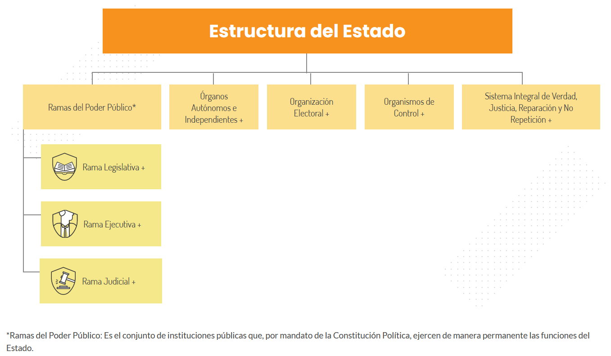

---
output:
  word_document: default
  html_document: default
  pdf_document: default
---
# Instituciones, Estado, Economía

## Definiciones

-   Instituciones: los individuos que pueblan una sociedad actúan e interactúan teniendo en cuenta las normas sociales y jurídicas prevalecientes. A este conjutno de *reglas de juego* es a lo que se le suele denominar como instituciones. El área de la economía institucional con todas sus variantes es un campo e intenso debate.

-   Estado: en términos de Max Weber es un sistema de administración burocrática y legal capaz de gobernar una población y un territorio, y que reclama el monopolio del légitimo uso de la fuerza.

En las sociedades estatales hay una fuente de autoridad centralizada, ej. presidente, que se apoya en una jerarquía de subordinados, quienes hacen uso del poder coercitivo del Estado para imponer el cumplimiento de normas al resto de la sociedad. La fuente de autoridad es superior a otra que haya en el territorio, por eso se considerda soberana. La autoridad para la toma de decisiones deriva de la asociación formal con el soberano @fukuyama2011

En el libro ¿Por qué Fracasan los Países? los economistas Daron Acemoglu y James Robinson argumentan que son las instituciones políticas y económicas las determinantes el éxito económico. Estos autores distinguen entre instituciones inclusivas y extractivas. Las primeras son aquellas que estimulan la párticipación de un gran número personas en las actividades económicas donde hacen el mejor uso de sus habilidades y talentos, y permiten que los individuos elijan libremente. La propiedad privada, sistema legal imparcial, y provisión de los servicios públicos (no restringir únicamente a los servicios domiciliarios básicos) necesarios para igualar el campo de juego en el que los individuos llevan cabo los intercambios y contratos. No hay barreras de entrada a los negocios ni a la elección de carreras.

Este tipo de instituiciones promueven la productividad y la prosperidad económica. Por contra, las instituciones extractivas son aquellas que están diseñadas para extraer el ingreso y la riqueza de unos miembros de la sociedad para beneficiar a otros. Los derechos de propiedad inseguros, el clientelismo, la corrupción, son prácticas extractivas que detienen el avance social ¿Cuál es el origen de estas instituciones? ¿Es el resultado del diseño deliberado o son propiedades emergentes? ¿Estamos condenados por la historia?

## Democratización, idas y venidas

Si bien la taxonomía propuesta por Acemoglu y Robinson no se traslada directamente a la presencia de un régimen democrático, si se puede argumentar que hay una correspondencia cercana entre la idea de instituciones inclusivas y la democracia. Esta última se podría entender a partr de la existencia de tres elementos interdependientes:

1.  Instituciones y procedimientos a través de los cuales los ciudadanos pueen efectivamente expresar sus preferencias respecto a políticas y líderes. Las votaciones libres y transparentes son uno de los más importantes

2.  Restricciones institucionalizadas al ejercicio del poder por parte del ejecutivo. El llamado sistema de pesos y contrapesos.

3.  Garantías de libertades civiles a todos los ciudadanos en su vida cotidiana así como en la participación política

A partir de estos tres elementos el [Polity Project](https://www.systemicpeace.org/inscrdata.html), caracteriza a las sociedades en una escala que va de -10, fuertemente autocrático, a +10, fuertemente democrático. La medición para Colombia es como sigue

<div class="figure">

```{=html}
<div id="htmlwidget-f4ea082840f284b6d788" style="width:672px;height:480px;" class="plotly html-widget"></div>
<script type="application/json" data-for="htmlwidget-f4ea082840f284b6d788">{"x":{"data":[{"x":[1832,1833,1834,1835,1836,1837,1838,1839,1840,1841,1842,1843,1844,1845,1846,1847,1848,1849,1850,1851,1852,1853,1854,1855,1856,1857,1858,1859,1860,1861,1862,1863,1864,1865,1866,1867,1868,1869,1870,1871,1872,1873,1874,1875,1876,1877,1878,1879,1880,1881,1882,1883,1884,1885,1886,1887,1888,1889,1890,1891,1892,1893,1894,1895,1896,1897,1898,1899,1900,1901,1902,1903,1904,1905,1906,1907,1908,1909,1910,1911,1912,1913,1914,1915,1916,1917,1918,1919,1920,1921,1922,1923,1924,1925,1926,1927,1928,1929,1930,1931,1932,1933,1934,1935,1936,1937,1938,1939,1940,1941,1942,1943,1944,1945,1946,1947,1948,1949,1950,1951,1952,1953,1954,1955,1956,1957,1958,1959,1960,1961,1962,1963,1964,1965,1966,1967,1968,1969,1970,1971,1972,1973,1974,1975,1976,1977,1978,1979,1980,1981,1982,1983,1984,1985,1986,1987,1988,1989,1990,1991,1992,1993,1994,1995,1996,1997,1998,1999,2000,2001,2002,2003,2004,2005,2006,2007,2008,2009,2010,2011,2012,2013,2014,2015,2016,2017,2018],"y":[2,2,2,2,2,2,2,2,2,2,2,2,2,2,2,2,2,2,2,2,2,2,2,2,2,2,2,2,0,-5,-5,-5,-5,-5,-5,8,8,8,8,8,8,8,8,8,8,8,8,8,8,8,8,8,8,8,-3,-3,-3,-3,-3,-3,-3,-3,-3,-3,-3,-3,-3,-3,0,0,0,0,-5,-5,-5,-5,-5,-5,-5,-5,-5,-5,-5,-5,-5,-5,-5,-5,-5,-5,-5,-5,-5,-5,-5,-5,-5,-5,5,5,5,5,5,5,5,5,5,5,5,5,5,5,5,5,5,5,-5,-5,-5,-5,-5,-5,-5,-5,-5,7,7,7,7,7,7,7,7,7,7,7,7,7,7,7,7,7,8,8,8,8,8,8,8,8,8,8,8,8,8,8,8,8,8,9,9,9,9,7,7,7,7,7,7,7,7,7,7,7,7,7,7,7,7,7,7,7,7,7,7,7,7],"text":["year: 1832<br />polity2:  2","year: 1833<br />polity2:  2","year: 1834<br />polity2:  2","year: 1835<br />polity2:  2","year: 1836<br />polity2:  2","year: 1837<br />polity2:  2","year: 1838<br />polity2:  2","year: 1839<br />polity2:  2","year: 1840<br />polity2:  2","year: 1841<br />polity2:  2","year: 1842<br />polity2:  2","year: 1843<br />polity2:  2","year: 1844<br />polity2:  2","year: 1845<br />polity2:  2","year: 1846<br />polity2:  2","year: 1847<br />polity2:  2","year: 1848<br />polity2:  2","year: 1849<br />polity2:  2","year: 1850<br />polity2:  2","year: 1851<br />polity2:  2","year: 1852<br />polity2:  2","year: 1853<br />polity2:  2","year: 1854<br />polity2:  2","year: 1855<br />polity2:  2","year: 1856<br />polity2:  2","year: 1857<br />polity2:  2","year: 1858<br />polity2:  2","year: 1859<br />polity2:  2","year: 1860<br />polity2:  0","year: 1861<br />polity2: -5","year: 1862<br />polity2: -5","year: 1863<br />polity2: -5","year: 1864<br />polity2: -5","year: 1865<br />polity2: -5","year: 1866<br />polity2: -5","year: 1867<br />polity2:  8","year: 1868<br />polity2:  8","year: 1869<br />polity2:  8","year: 1870<br />polity2:  8","year: 1871<br />polity2:  8","year: 1872<br />polity2:  8","year: 1873<br />polity2:  8","year: 1874<br />polity2:  8","year: 1875<br />polity2:  8","year: 1876<br />polity2:  8","year: 1877<br />polity2:  8","year: 1878<br />polity2:  8","year: 1879<br />polity2:  8","year: 1880<br />polity2:  8","year: 1881<br />polity2:  8","year: 1882<br />polity2:  8","year: 1883<br />polity2:  8","year: 1884<br />polity2:  8","year: 1885<br />polity2:  8","year: 1886<br />polity2: -3","year: 1887<br />polity2: -3","year: 1888<br />polity2: -3","year: 1889<br />polity2: -3","year: 1890<br />polity2: -3","year: 1891<br />polity2: -3","year: 1892<br />polity2: -3","year: 1893<br />polity2: -3","year: 1894<br />polity2: -3","year: 1895<br />polity2: -3","year: 1896<br />polity2: -3","year: 1897<br />polity2: -3","year: 1898<br />polity2: -3","year: 1899<br />polity2: -3","year: 1900<br />polity2:  0","year: 1901<br />polity2:  0","year: 1902<br />polity2:  0","year: 1903<br />polity2:  0","year: 1904<br />polity2: -5","year: 1905<br />polity2: -5","year: 1906<br />polity2: -5","year: 1907<br />polity2: -5","year: 1908<br />polity2: -5","year: 1909<br />polity2: -5","year: 1910<br />polity2: -5","year: 1911<br />polity2: -5","year: 1912<br />polity2: -5","year: 1913<br />polity2: -5","year: 1914<br />polity2: -5","year: 1915<br />polity2: -5","year: 1916<br />polity2: -5","year: 1917<br />polity2: -5","year: 1918<br />polity2: -5","year: 1919<br />polity2: -5","year: 1920<br />polity2: -5","year: 1921<br />polity2: -5","year: 1922<br />polity2: -5","year: 1923<br />polity2: -5","year: 1924<br />polity2: -5","year: 1925<br />polity2: -5","year: 1926<br />polity2: -5","year: 1927<br />polity2: -5","year: 1928<br />polity2: -5","year: 1929<br />polity2: -5","year: 1930<br />polity2:  5","year: 1931<br />polity2:  5","year: 1932<br />polity2:  5","year: 1933<br />polity2:  5","year: 1934<br />polity2:  5","year: 1935<br />polity2:  5","year: 1936<br />polity2:  5","year: 1937<br />polity2:  5","year: 1938<br />polity2:  5","year: 1939<br />polity2:  5","year: 1940<br />polity2:  5","year: 1941<br />polity2:  5","year: 1942<br />polity2:  5","year: 1943<br />polity2:  5","year: 1944<br />polity2:  5","year: 1945<br />polity2:  5","year: 1946<br />polity2:  5","year: 1947<br />polity2:  5","year: 1948<br />polity2: -5","year: 1949<br />polity2: -5","year: 1950<br />polity2: -5","year: 1951<br />polity2: -5","year: 1952<br />polity2: -5","year: 1953<br />polity2: -5","year: 1954<br />polity2: -5","year: 1955<br />polity2: -5","year: 1956<br />polity2: -5","year: 1957<br />polity2:  7","year: 1958<br />polity2:  7","year: 1959<br />polity2:  7","year: 1960<br />polity2:  7","year: 1961<br />polity2:  7","year: 1962<br />polity2:  7","year: 1963<br />polity2:  7","year: 1964<br />polity2:  7","year: 1965<br />polity2:  7","year: 1966<br />polity2:  7","year: 1967<br />polity2:  7","year: 1968<br />polity2:  7","year: 1969<br />polity2:  7","year: 1970<br />polity2:  7","year: 1971<br />polity2:  7","year: 1972<br />polity2:  7","year: 1973<br />polity2:  7","year: 1974<br />polity2:  8","year: 1975<br />polity2:  8","year: 1976<br />polity2:  8","year: 1977<br />polity2:  8","year: 1978<br />polity2:  8","year: 1979<br />polity2:  8","year: 1980<br />polity2:  8","year: 1981<br />polity2:  8","year: 1982<br />polity2:  8","year: 1983<br />polity2:  8","year: 1984<br />polity2:  8","year: 1985<br />polity2:  8","year: 1986<br />polity2:  8","year: 1987<br />polity2:  8","year: 1988<br />polity2:  8","year: 1989<br />polity2:  8","year: 1990<br />polity2:  8","year: 1991<br />polity2:  9","year: 1992<br />polity2:  9","year: 1993<br />polity2:  9","year: 1994<br />polity2:  9","year: 1995<br />polity2:  7","year: 1996<br />polity2:  7","year: 1997<br />polity2:  7","year: 1998<br />polity2:  7","year: 1999<br />polity2:  7","year: 2000<br />polity2:  7","year: 2001<br />polity2:  7","year: 2002<br />polity2:  7","year: 2003<br />polity2:  7","year: 2004<br />polity2:  7","year: 2005<br />polity2:  7","year: 2006<br />polity2:  7","year: 2007<br />polity2:  7","year: 2008<br />polity2:  7","year: 2009<br />polity2:  7","year: 2010<br />polity2:  7","year: 2011<br />polity2:  7","year: 2012<br />polity2:  7","year: 2013<br />polity2:  7","year: 2014<br />polity2:  7","year: 2015<br />polity2:  7","year: 2016<br />polity2:  7","year: 2017<br />polity2:  7","year: 2018<br />polity2:  7"],"type":"scatter","mode":"lines","line":{"width":3.77952755905512,"color":"rgba(0,0,0,1)","dash":"solid"},"hoveron":"points","showlegend":false,"xaxis":"x","yaxis":"y","hoverinfo":"text","frame":null},{"x":[1953,1953],"y":[-5.7,9.7],"text":"xintercept: 1953","type":"scatter","mode":"lines","line":{"width":1.88976377952756,"color":"rgba(255,0,0,1)","dash":"solid"},"hoveron":"points","showlegend":false,"xaxis":"x","yaxis":"y","hoverinfo":"text","frame":null},{"x":[1991,1991],"y":[-5.7,9.7],"text":"xintercept: 1991","type":"scatter","mode":"lines","line":{"width":1.88976377952756,"color":"rgba(255,0,0,1)","dash":"solid"},"hoveron":"points","showlegend":false,"xaxis":"x","yaxis":"y","hoverinfo":"text","frame":null}],"layout":{"margin":{"t":26.2283105022831,"r":7.30593607305936,"b":40.1826484018265,"l":37.2602739726027},"plot_bgcolor":"rgba(235,235,235,1)","paper_bgcolor":"rgba(255,255,255,1)","font":{"color":"rgba(0,0,0,1)","family":"","size":14.6118721461187},"xaxis":{"domain":[0,1],"automargin":true,"type":"linear","autorange":false,"range":[1822.7,2027.3],"tickmode":"array","ticktext":["1825","1875","1925","1975","2025"],"tickvals":[1825,1875,1925,1975,2025],"categoryorder":"array","categoryarray":["1825","1875","1925","1975","2025"],"nticks":null,"ticks":"outside","tickcolor":"rgba(51,51,51,1)","ticklen":3.65296803652968,"tickwidth":0.66417600664176,"showticklabels":true,"tickfont":{"color":"rgba(77,77,77,1)","family":"","size":11.689497716895},"tickangle":-0,"showline":false,"linecolor":null,"linewidth":0,"showgrid":true,"gridcolor":"rgba(255,255,255,1)","gridwidth":0.66417600664176,"zeroline":false,"anchor":"y","title":{"text":"Año","font":{"color":"rgba(0,0,0,1)","family":"","size":14.6118721461187}},"hoverformat":".2f"},"yaxis":{"domain":[0,1],"automargin":true,"type":"linear","autorange":false,"range":[-5.7,9.7],"tickmode":"array","ticktext":["-5","0","5"],"tickvals":[-5,0,5],"categoryorder":"array","categoryarray":["-5","0","5"],"nticks":null,"ticks":"outside","tickcolor":"rgba(51,51,51,1)","ticklen":3.65296803652968,"tickwidth":0.66417600664176,"showticklabels":true,"tickfont":{"color":"rgba(77,77,77,1)","family":"","size":11.689497716895},"tickangle":-0,"showline":false,"linecolor":null,"linewidth":0,"showgrid":true,"gridcolor":"rgba(255,255,255,1)","gridwidth":0.66417600664176,"zeroline":false,"anchor":"x","title":{"text":"Grado de democracia","font":{"color":"rgba(0,0,0,1)","family":"","size":14.6118721461187}},"hoverformat":".2f"},"shapes":[{"type":"rect","fillcolor":null,"line":{"color":null,"width":0,"linetype":[]},"yref":"paper","xref":"paper","x0":0,"x1":1,"y0":0,"y1":1}],"showlegend":false,"legend":{"bgcolor":"rgba(255,255,255,1)","bordercolor":"transparent","borderwidth":1.88976377952756,"font":{"color":"rgba(0,0,0,1)","family":"","size":11.689497716895}},"hovermode":"closest","barmode":"relative"},"config":{"doubleClick":"reset","showSendToCloud":false},"source":"A","attrs":{"208c508a2728":{"x":{},"y":{},"type":"scatter"},"208c3f9c2453":{"xintercept":{}},"208c11695685":{"xintercept":{}}},"cur_data":"208c508a2728","visdat":{"208c508a2728":["function (y) ","x"],"208c3f9c2453":["function (y) ","x"],"208c11695685":["function (y) ","x"]},"highlight":{"on":"plotly_click","persistent":false,"dynamic":false,"selectize":false,"opacityDim":0.2,"selected":{"opacity":1},"debounce":0},"shinyEvents":["plotly_hover","plotly_click","plotly_selected","plotly_relayout","plotly_brushed","plotly_brushing","plotly_clickannotation","plotly_doubleclick","plotly_deselect","plotly_afterplot","plotly_sunburstclick"],"base_url":"https://plot.ly"},"evals":[],"jsHooks":[]}</script>
```

<p class="caption">(\#fig:unnamed-chunk-1)Democratización a lo largo del tiempo. Fuente: PolityV Project</p>
</div>

La construcción del Estado colombiano no ha sido un proceso lineal y pacífico. Por el contario, la pugnacidad entre partidos políticos, la oposición armadar al gobierno, el narcotráfico, entre otros fenómenos, han impregnado a la sociedad colombiana de una violencia sistemática que se niega a desaparecer. Al tiempo que ha facilitado, y hasta promovido, normas sociales y conductas individuales depredadoras y rentistas. Recientemente el país parece haber superado la violencia política partidista, ha hecho esfuerzos por promover la apertura política, ha defendido la competencia económica y la libertad de empresa. Sin embargo, el clientelismo, la corrupción, y la presencia desigual del Estado en el territorio, amenazan los avances logrados.

## Estructura del Estado Colombiano

<div class="figure">

<p class="caption">(\#fig:unnamed-chunk-2)Estructura del Estado Colombiano</p>
</div>

El poder público ejecuta las acciones necesarias para alcanzar los fines del Estado. Los organismos autónomos tienen un régimen especial y autonomía para desempeñar funciones específicas. Los organismos de control verifican y controlan la gestión fiscal y administrativa de las entidades públicas. No están adscritos ni vinculados a las ramas del poder público. En el ámbito económico, las entidades más importantes son el Ministerio de Hacienda, el Departamento Nacional de Planeación, y el Banco de la República. Consulte [aquí](https://www.funcionpublica.gov.co/eva/gestornormativo/manual-estado/index.php)
