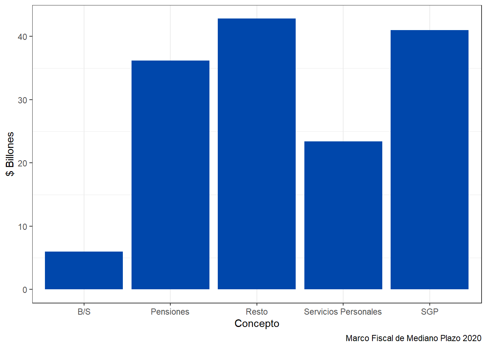
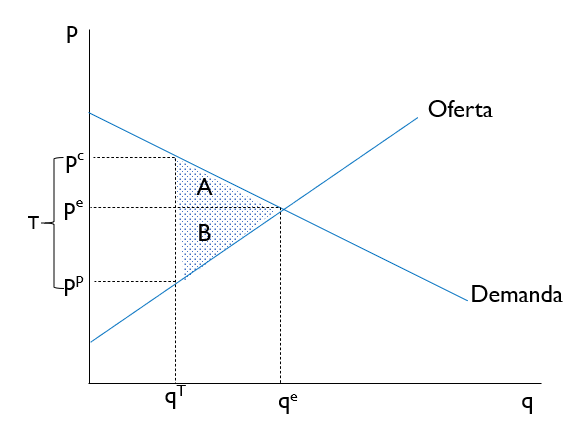
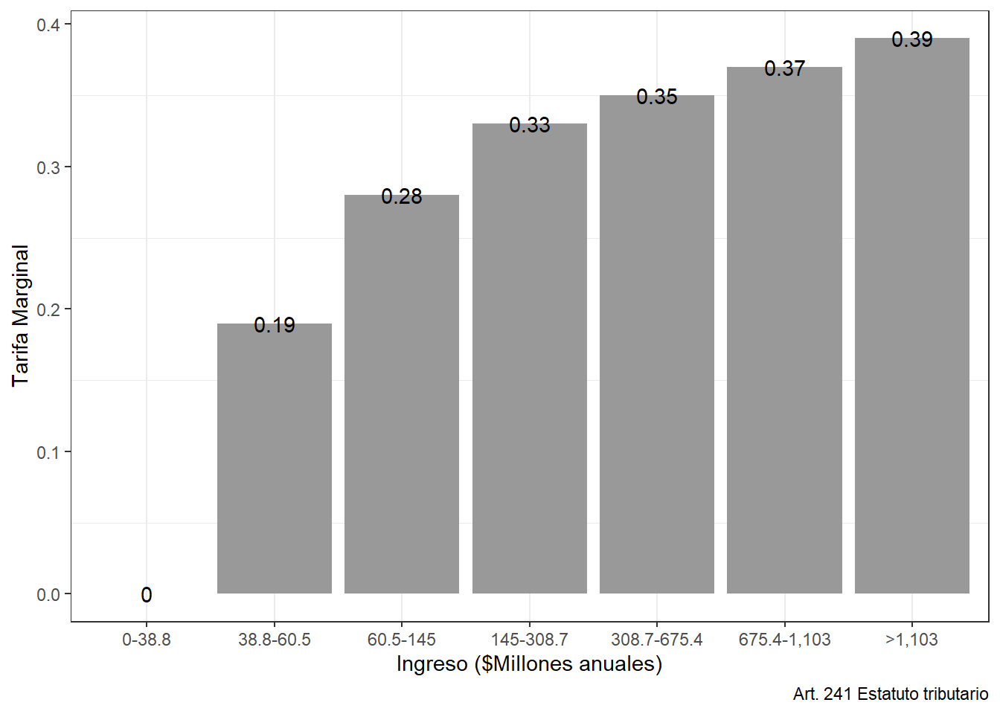

---
output:
  word_document: default
  html_document: default
  pdf_document: default
---

# Estado: Gasto y Tributación

## Gasto público, impuestos y deuda

Tomemos como punto de partida la identidad del ingreso nacional^[Para simplificar suponemos que la renta neta de factores es cero]
\begin{equation}
Y=C+I+G+X-M
\end{equation}

Si restamos a ambos lados los impuestos, $T$, y después de reorganizar los términos tenemos

\begin{equation}
(T-G)+(Y-T-C-I)+(M-X)=0
\end{equation}

Esta identidad nos dice que la suma del ahorro público, ahorro privado neto y ahorro externo es cero. Luego, si el gasto público, $G$, excede a los impuestos, $T$, entonces la suma del ahorro privado y externo debe ser positiva. Ello quiere decir que el déficit público es compensado con un superávit primario o usando ahorro del resto del mundo. En las cuentas fiscales esto se refleja en la emisión de deuda interna y/o externa. 

## Sobre el rol del Estado en la economía

¿Cómo surge el Estado? Una explicación tiene que ver con la amenaza de la violencia organizada. Así, la jerarquía y el Estado podrían haber surgido cuando un grupo tribal conquista a otro y obtiene el control territorial. Mantener el control sobre los conquistados en un incentivo muy fuerte para producir instituciones instituciones centralizadas capaces de ejercer represión y dominio amplio. A su vez, la amenazada de ser conquistado puede llevar a que varios grupos tribales relacionados acuerden ceder parte de su autoridad a una forma de mando centralizada a fin de lograr una coordinación efectiva en tiempo de guerra. Claro, esto no quiere decir que la violencia entre tríbus diese lugar de manera inexorable al surgimiento de Estados, ni que todos los estados hayan nacido de la guerra @fukuyama2011. Sin embargo, como dice el historiador Ian Morris en su libro *Guerra ¿Para qué sirve?*  "la guerra hace al Estado y el Estado hace la guerra" @morris2017

Se cual fuese la explicación correcta, lo cierto es que el Estado existe y ejerce influencia sobre el sistema económico y nuestra vida cotidiana. Dado que este existe, la pregunta es entonces ¿Cuál **debe** ser el papel del Estado en la economía? Note que la pregunta no es ¿Cuál **es** el rol del Estado? Así, la primera indagación es de carácter normativo, estamos buscando es una *justificación*, un juicio valorativo a partir del cual llegamos a concluir que el Estado debe hacer esto y aquello. La segunda pregunta es de un alcance más limitado, ella solo nos pide una descripción de las cosas tal cual son, independientemente de si consideramos que así es como estas deberían ser.

Si tomamos como punto de partida las funciones mínimas que el Estado desempeña para garantizar su permanencia, a saber, el uso de de la coerción para mantener el control de la población y el territorio, entonces esperamos que esto corresponda a la provisión de los servicios de seguridad, defensa y justicia. El Estado es los suficientemente fuerte como para reducir la violencia y garantizar el cumplimiento de los acuerdos entre los miembros de la sociedad.  De ahí en adelante el alcance de la acción del Estado puede extenderse considerablemente ¿Qué tanto? La posición predominante entre los economistas es que e Estado debe actuar allí donde el mercado falla. 

Si el mercado es un mecanismo que asigna los recursos productivos de la sociedad para la producción de bienes y servicios, en variedad y cantidad tal que permite la satisfacción de las multitud de preferencias individuales, y si este mecanismo es superior a otros alternativos, entonces decimos que falla cuando no produce resultados satisfactorios. Es decir, resulta en la producción de mucho de aquello que no queremos, ej. contaminación, y muy poco de aquello que deseamos, ej. servicios de salud de calidad. En economía se suele hablar de las siguientes fallas

- Externalidad: los agentes no incorporan en sus decisiones la totalidad de los costos (beneficios) que conlleva su acción y por lo tanto los traslada, involuntariamente, a otros consumidores y/o productores. 

- Bienes no privados: ausencia de rivalidad y/o exclusión

- Asimetrias de información: una de las partes en la transacción sabe algo relevante que la otra parte no sabe

- Estructuras de mercado no competitivas: otorga poder de fijación de precios

Además de las fallas de mercado, la ampliación del ámbito de acción del Estado se ha justificado también porque de alguna manera se considera que este debe redistribuir recursos para que la sociedad sea más equitativa. A fin de cuentas el mercado asigna recursos tomando como dada la estructura distributiva tal cual, sin preguntarse por la justicia de esta. En asocio con esto tenemos la idea según la cual hay ciertos bienes, como la educación, que se consideran socialmente deseables y que por lo tanto, se argumenta, deben ser provistos directamente por el Estado, o con su intervención, para garantizar que no hay barreras para acceder a ellos.  

La corrección de las fallas y la redistribución la logra el Estado a través de: 1) la regulación de la actividad económica, ej. controlando precios; 2) el uso de impuestos y subsidios; 3) provisión directa de bienes y servicios; 4) financiación de la demanda. 

Las corrientes de pensamiento liberal que desconfían profundamente en la capacidad del Estado para alcanzar los objetivos que se propone y respetar las libertades individuales ven en esta narrativa de fallas del mercado demasiadas instancias de intervención estatal. Por ejemplo, @mccloskey2016 afirma 

> "The fact suggest that the projects of betterment enacted by governments, compared with voluntary deals made among consenting adults free of force or fraud, will fail, as they regularly have, because they are directed not at general betterment but at enriching special interests at the expense of the generality, or merely spending what money the government can appropriate under the threat of violence"
>
><footer>--- Deirdre McCloskey</footer>

Aún si los individuos que integran el Estado son las personas más altruistas e idealistas, ¿cómo pueden saber ellos cuales son los mejores usos de los recursos disponibles de la sociedad? Esta, una de las observaciones fundamentales de Hayek, es una difícil cuestión que todo defensor de la planeación económica debe enfrentar. 

En contraposición, los economistas cercanos al progresismo creen que el gobierno es capaz de controlar la economía y guiarla en la dirección deseada. Dicen @mitchell2019 "(...) los gobiernos siempre pueden escoger y mantener una tasa de desempleo particular (...) entendemos que la economía solo servirá nuestros propósitos comunes si está sujeta a la vigilancia y control". 

Así, frente a la pregunta inicial, ¿Cuál **debe** ser el papel del Estado en la economía?, debe quedar claro que estamos lejos de un consenso sobre el asunto. En la práctica, lo que el Estado termina haciendo es un resultado, un producto de la interacción entre los agentes de la sociedad y las condiciones externas. Veamos el caso Colombiano

## ¿Cuánto gasta y en qué gasta el gobierno Colombiano?

Como sabemos del capítulo anterior, el Estado es más que el gobierno, sin embargo, desde el punto de vista de la ejecución de gasto público este es el más importante. Así, en lo que sigue haremos énfasis en el gobierno central, aunque mostraremos algunas cifras para otras instancias del sector público.  


```{=html}
<template id="7852be69-b2c2-4c61-88f7-17708d392b8c"><style>
.tabwid table{
  border-collapse:collapse;
  line-height:1;
  margin-left:auto;
  margin-right:auto;
  border-width: 0;
  display: table;
  margin-top: 1.275em;
  margin-bottom: 1.275em;
  border-spacing: 0;
  border-color: transparent;
}
.tabwid_left table{
  margin-left:0;
}
.tabwid_right table{
  margin-right:0;
}
.tabwid td {
    padding: 0;
}
.tabwid a {
  text-decoration: none;
}
.tabwid thead {
    background-color: transparent;
}
.tabwid tfoot {
    background-color: transparent;
}
.tabwid table tr {
background-color: transparent;
}
</style><div class="tabwid"><style>.cl-0435eb0e{table-layout:auto;border-collapse:collapse;width:50%;}.cl-042b61fc{font-family:'Arial';font-size:11pt;font-weight:bold;font-style:normal;text-decoration:none;color:rgba(0, 0, 0, 1.00);background-color:transparent;}.cl-042b61fd{font-family:'Arial';font-size:11pt;font-weight:normal;font-style:normal;text-decoration:none;color:rgba(0, 0, 0, 1.00);background-color:transparent;}.cl-042b61fe{margin:0;text-align:left;border-bottom: 0 solid rgba(0, 0, 0, 1.00);border-top: 0 solid rgba(0, 0, 0, 1.00);border-left: 0 solid rgba(0, 0, 0, 1.00);border-right: 0 solid rgba(0, 0, 0, 1.00);padding-bottom:5pt;padding-top:5pt;padding-left:5pt;padding-right:5pt;line-height: 1;background-color:transparent;}.cl-042b61ff{margin:0;text-align:right;border-bottom: 0 solid rgba(0, 0, 0, 1.00);border-top: 0 solid rgba(0, 0, 0, 1.00);border-left: 0 solid rgba(0, 0, 0, 1.00);border-right: 0 solid rgba(0, 0, 0, 1.00);padding-bottom:5pt;padding-top:5pt;padding-left:5pt;padding-right:5pt;line-height: 1;background-color:transparent;}.cl-042b6200{background-clip: padding-box;background-color:rgba(239, 239, 239, 1.00);vertical-align: middle;border-bottom: 0 solid rgba(0, 0, 0, 1.00);border-top: 0 solid rgba(0, 0, 0, 1.00);border-left: 0 solid rgba(0, 0, 0, 1.00);border-right: 0 solid rgba(0, 0, 0, 1.00);margin-bottom:0;margin-top:0;margin-left:0;margin-right:0;}.cl-042b6201{background-clip: padding-box;background-color:rgba(239, 239, 239, 1.00);vertical-align: middle;border-bottom: 0 solid rgba(0, 0, 0, 1.00);border-top: 0 solid rgba(0, 0, 0, 1.00);border-left: 0 solid rgba(0, 0, 0, 1.00);border-right: 0 solid rgba(0, 0, 0, 1.00);margin-bottom:0;margin-top:0;margin-left:0;margin-right:0;}.cl-042b6202{background-color:transparent;vertical-align: middle;border-bottom: 0 solid rgba(0, 0, 0, 1.00);border-top: 0 solid rgba(0, 0, 0, 1.00);border-left: 0 solid rgba(0, 0, 0, 1.00);border-right: 0 solid rgba(0, 0, 0, 1.00);margin-bottom:0;margin-top:0;margin-left:0;margin-right:0;}.cl-042b6203{background-color:transparent;vertical-align: middle;border-bottom: 0 solid rgba(0, 0, 0, 1.00);border-top: 0 solid rgba(0, 0, 0, 1.00);border-left: 0 solid rgba(0, 0, 0, 1.00);border-right: 0 solid rgba(0, 0, 0, 1.00);margin-bottom:0;margin-top:0;margin-left:0;margin-right:0;}.cl-042b6204{background-clip: padding-box;background-color:rgba(207, 207, 207, 1.00);vertical-align: middle;border-bottom: 0 solid rgba(0, 0, 0, 1.00);border-top: 0 solid rgba(0, 0, 0, 1.00);border-left: 0 solid rgba(0, 0, 0, 1.00);border-right: 0 solid rgba(0, 0, 0, 1.00);margin-bottom:0;margin-top:0;margin-left:0;margin-right:0;}.cl-042b6205{background-clip: padding-box;background-color:rgba(207, 207, 207, 1.00);vertical-align: middle;border-bottom: 0 solid rgba(0, 0, 0, 1.00);border-top: 0 solid rgba(0, 0, 0, 1.00);border-left: 0 solid rgba(0, 0, 0, 1.00);border-right: 0 solid rgba(0, 0, 0, 1.00);margin-bottom:0;margin-top:0;margin-left:0;margin-right:0;}caption {color: #777;margin-top: 10px;margin-bottom: 10px;text-align: center;}</style><table class='cl-0435eb0e'>
```
<caption class="Table Caption">(\#tab:unnamed-chunk-1)Ingresos y Gastos GNC. Fuente: Plan Financiero 2020</caption>
```{=html}
<thead><tr style="overflow-wrap:break-word;"><td class="cl-042b6204"><p class="cl-042b61fe"><span class="cl-042b61fc">Concepto</span></p></td><td class="cl-042b6205"><p class="cl-042b61ff"><span class="cl-042b61fc">2019 ($Bn)</span></p></td><td class="cl-042b6205"><p class="cl-042b61ff"><span class="cl-042b61fc">2019 (%PIB)</span></p></td></tr></thead><tbody><tr style="overflow-wrap:break-word;"><td class="cl-042b6201"><p class="cl-042b61fe"><span class="cl-042b61fc">Ingresos totales</span></p></td><td class="cl-042b6200"><p class="cl-042b61ff"><span class="cl-042b61fc">171.8</span></p></td><td class="cl-042b6200"><p class="cl-042b61ff"><span class="cl-042b61fc">16.5</span></p></td></tr><tr style="overflow-wrap:break-word;"><td class="cl-042b6202"><p class="cl-042b61fe"><span class="cl-042b61fd">Tributarios</span></p></td><td class="cl-042b6203"><p class="cl-042b61ff"><span class="cl-042b61fd">148.4</span></p></td><td class="cl-042b6203"><p class="cl-042b61ff"><span class="cl-042b61fd">14.3</span></p></td></tr><tr style="overflow-wrap:break-word;"><td class="cl-042b6201"><p class="cl-042b61fe"><span class="cl-042b61fd">No Tributarios</span></p></td><td class="cl-042b6200"><p class="cl-042b61ff"><span class="cl-042b61fd">1.5</span></p></td><td class="cl-042b6200"><p class="cl-042b61ff"><span class="cl-042b61fd">0.1</span></p></td></tr><tr style="overflow-wrap:break-word;"><td class="cl-042b6202"><p class="cl-042b61fe"><span class="cl-042b61fd">Fondos especiales</span></p></td><td class="cl-042b6203"><p class="cl-042b61ff"><span class="cl-042b61fd">1.5</span></p></td><td class="cl-042b6203"><p class="cl-042b61ff"><span class="cl-042b61fd">0.1</span></p></td></tr><tr style="overflow-wrap:break-word;"><td class="cl-042b6201"><p class="cl-042b61fe"><span class="cl-042b61fd">Recursos de capital</span></p></td><td class="cl-042b6200"><p class="cl-042b61ff"><span class="cl-042b61fd">20.5</span></p></td><td class="cl-042b6200"><p class="cl-042b61ff"><span class="cl-042b61fd">2.0</span></p></td></tr><tr style="overflow-wrap:break-word;"><td class="cl-042b6202"><p class="cl-042b61fe"><span class="cl-042b61fc">Gastos totales</span></p></td><td class="cl-042b6203"><p class="cl-042b61ff"><span class="cl-042b61fc">197.9</span></p></td><td class="cl-042b6203"><p class="cl-042b61ff"><span class="cl-042b61fc">19.0</span></p></td></tr><tr style="overflow-wrap:break-word;"><td class="cl-042b6201"><p class="cl-042b61fe"><span class="cl-042b61fd">Intereses</span></p></td><td class="cl-042b6200"><p class="cl-042b61ff"><span class="cl-042b61fd">30.8</span></p></td><td class="cl-042b6200"><p class="cl-042b61ff"><span class="cl-042b61fd">3.0</span></p></td></tr><tr style="overflow-wrap:break-word;"><td class="cl-042b6202"><p class="cl-042b61fe"><span class="cl-042b61fd">Funcionamiento</span></p></td><td class="cl-042b6203"><p class="cl-042b61ff"><span class="cl-042b61fd">149.4</span></p></td><td class="cl-042b6203"><p class="cl-042b61ff"><span class="cl-042b61fd">14.3</span></p></td></tr><tr style="overflow-wrap:break-word;"><td class="cl-042b6201"><p class="cl-042b61fe"><span class="cl-042b61fd">Inversión</span></p></td><td class="cl-042b6200"><p class="cl-042b61ff"><span class="cl-042b61fd">17.9</span></p></td><td class="cl-042b6200"><p class="cl-042b61ff"><span class="cl-042b61fd">1.7</span></p></td></tr><tr style="overflow-wrap:break-word;"><td class="cl-042b6202"><p class="cl-042b61fe"><span class="cl-042b61fc">Balance Total</span></p></td><td class="cl-042b6203"><p class="cl-042b61ff"><span class="cl-042b61fc">-26.0</span></p></td><td class="cl-042b6203"><p class="cl-042b61ff"><span class="cl-042b61fc">-2.5</span></p></td></tr></tbody></table></div></template>
<div id="d0b6119a-48f3-48aa-b419-6fd34ba5f6e1"></div>
<script>
var dest = document.getElementById("d0b6119a-48f3-48aa-b419-6fd34ba5f6e1");
var template = document.getElementById("7852be69-b2c2-4c61-88f7-17708d392b8c");
var caption = template.content.querySelector("caption");
if(caption) {
  caption.style.cssText = "display:block;text-align:center;";
  var newcapt = document.createElement("p");
  newcapt.appendChild(caption)
  dest.parentNode.insertBefore(newcapt, dest.previousSibling);
}
var fantome = dest.attachShadow({mode: 'open'});
var templateContent = template.content;
fantome.appendChild(templateContent);
</script>

```


Como vemos, el GNC tuvo un déficit de $26 billones durante 2019, los cuales tuvo que financiar de alguna manera. Más adelante veremos la composición del endeudamiento público. Desde el punto de vista de los ingresos, es claro que los tributarios son lo más importantes, mientras que desde el punto de vista del gasto aquellos destinados a funcionamiento se llevan la mayor tajada. Dentro de los gastos de funcionamiento se encuentran las transferencias que hace la Nación a las entidades territoriales, municipios y gobernaciones, y que en gran medida van dirigidas a financiar la ejecución de gasto social. Del total de gastos de funcionamiento %80 corresponden a transferencias que hace el GNC a otras entidades. Así, en la práctica, esto implica que la ejecución del gasto social en el territorio está cargo de gobernaciones y alcaldías usando recursos que no se han generado dentro de su jurisdicción. Si bien esto permite corregir disparidades regionales en la capacidad de provisión de servicios sociales, también implica que los gobiernos locales y regionales ejecutan recursos bajo directrices del gobierno central. Todo esto hace parte del régimen de descentralización del país, así como de las pujas por mayor autonomía territorial. 


<div class="figure">

<p class="caption">(\#fig:unnamed-chunk-2)Composición del gasto de Funcionamiento. Fuente: MFMP 2020</p>
</div>

Si se desagrega el gasto total del GNC en función de las bienes y servicios que provee, encontramos que cerca del 69% es gasto social y el restante provisión de bienes públicos [@lora2019]

```{=html}
<template id="ddd7134a-57fb-48fd-a32d-66aa5779beb5"><style>
.tabwid table{
  border-collapse:collapse;
  line-height:1;
  margin-left:auto;
  margin-right:auto;
  border-width: 0;
  display: table;
  margin-top: 1.275em;
  margin-bottom: 1.275em;
  border-spacing: 0;
  border-color: transparent;
}
.tabwid_left table{
  margin-left:0;
}
.tabwid_right table{
  margin-right:0;
}
.tabwid td {
    padding: 0;
}
.tabwid a {
  text-decoration: none;
}
.tabwid thead {
    background-color: transparent;
}
.tabwid tfoot {
    background-color: transparent;
}
.tabwid table tr {
background-color: transparent;
}
</style><div class="tabwid"><style>.cl-04f96a20{table-layout:auto;border-collapse:collapse;width:50%;}.cl-04ed7d50{font-family:'Arial';font-size:11pt;font-weight:bold;font-style:normal;text-decoration:none;color:rgba(0, 0, 0, 1.00);background-color:transparent;}.cl-04ed7d51{font-family:'Arial';font-size:11pt;font-weight:normal;font-style:normal;text-decoration:none;color:rgba(0, 0, 0, 1.00);background-color:transparent;}.cl-04ed7d52{margin:0;text-align:left;border-bottom: 0 solid rgba(0, 0, 0, 1.00);border-top: 0 solid rgba(0, 0, 0, 1.00);border-left: 0 solid rgba(0, 0, 0, 1.00);border-right: 0 solid rgba(0, 0, 0, 1.00);padding-bottom:5pt;padding-top:5pt;padding-left:5pt;padding-right:5pt;line-height: 1;background-color:transparent;}.cl-04ed7d53{margin:0;text-align:right;border-bottom: 0 solid rgba(0, 0, 0, 1.00);border-top: 0 solid rgba(0, 0, 0, 1.00);border-left: 0 solid rgba(0, 0, 0, 1.00);border-right: 0 solid rgba(0, 0, 0, 1.00);padding-bottom:5pt;padding-top:5pt;padding-left:5pt;padding-right:5pt;line-height: 1;background-color:transparent;}.cl-04ed7d54{background-clip: padding-box;background-color:rgba(239, 239, 239, 1.00);vertical-align: middle;border-bottom: 0 solid rgba(0, 0, 0, 1.00);border-top: 0 solid rgba(0, 0, 0, 1.00);border-left: 0 solid rgba(0, 0, 0, 1.00);border-right: 0 solid rgba(0, 0, 0, 1.00);margin-bottom:0;margin-top:0;margin-left:0;margin-right:0;}.cl-04ed7d55{background-clip: padding-box;background-color:rgba(239, 239, 239, 1.00);vertical-align: middle;border-bottom: 0 solid rgba(0, 0, 0, 1.00);border-top: 0 solid rgba(0, 0, 0, 1.00);border-left: 0 solid rgba(0, 0, 0, 1.00);border-right: 0 solid rgba(0, 0, 0, 1.00);margin-bottom:0;margin-top:0;margin-left:0;margin-right:0;}.cl-04ed7d56{background-color:transparent;vertical-align: middle;border-bottom: 0 solid rgba(0, 0, 0, 1.00);border-top: 0 solid rgba(0, 0, 0, 1.00);border-left: 0 solid rgba(0, 0, 0, 1.00);border-right: 0 solid rgba(0, 0, 0, 1.00);margin-bottom:0;margin-top:0;margin-left:0;margin-right:0;}.cl-04ed7d57{background-color:transparent;vertical-align: middle;border-bottom: 0 solid rgba(0, 0, 0, 1.00);border-top: 0 solid rgba(0, 0, 0, 1.00);border-left: 0 solid rgba(0, 0, 0, 1.00);border-right: 0 solid rgba(0, 0, 0, 1.00);margin-bottom:0;margin-top:0;margin-left:0;margin-right:0;}.cl-04ed7d58{background-clip: padding-box;background-color:rgba(207, 207, 207, 1.00);vertical-align: middle;border-bottom: 0 solid rgba(0, 0, 0, 1.00);border-top: 0 solid rgba(0, 0, 0, 1.00);border-left: 0 solid rgba(0, 0, 0, 1.00);border-right: 0 solid rgba(0, 0, 0, 1.00);margin-bottom:0;margin-top:0;margin-left:0;margin-right:0;}.cl-04ed7d59{background-clip: padding-box;background-color:rgba(207, 207, 207, 1.00);vertical-align: middle;border-bottom: 0 solid rgba(0, 0, 0, 1.00);border-top: 0 solid rgba(0, 0, 0, 1.00);border-left: 0 solid rgba(0, 0, 0, 1.00);border-right: 0 solid rgba(0, 0, 0, 1.00);margin-bottom:0;margin-top:0;margin-left:0;margin-right:0;}caption {color: #777;margin-top: 10px;margin-bottom: 10px;text-align: center;}</style><table class='cl-04f96a20'>
```
<caption class="Table Caption">(\#tab:unnamed-chunk-3)Composición del gasto GNC. Fuente: Lora (2019)</caption>
```{=html}
<thead><tr style="overflow-wrap:break-word;"><td class="cl-04ed7d58"><p class="cl-04ed7d52"><span class="cl-04ed7d50">Concepto</span></p></td><td class="cl-04ed7d59"><p class="cl-04ed7d53"><span class="cl-04ed7d50">2017 ($Bn)</span></p></td><td class="cl-04ed7d59"><p class="cl-04ed7d53"><span class="cl-04ed7d50">2017 (%PIB)</span></p></td></tr></thead><tbody><tr style="overflow-wrap:break-word;"><td class="cl-04ed7d55"><p class="cl-04ed7d52"><span class="cl-04ed7d50">Social</span></p></td><td class="cl-04ed7d54"><p class="cl-04ed7d53"><span class="cl-04ed7d50">119.4</span></p></td><td class="cl-04ed7d54"><p class="cl-04ed7d53"><span class="cl-04ed7d50">13.0</span></p></td></tr><tr style="overflow-wrap:break-word;"><td class="cl-04ed7d57"><p class="cl-04ed7d52"><span class="cl-04ed7d51">Pensiones</span></p></td><td class="cl-04ed7d56"><p class="cl-04ed7d53"><span class="cl-04ed7d51">40.9</span></p></td><td class="cl-04ed7d56"><p class="cl-04ed7d53"><span class="cl-04ed7d51">4.5</span></p></td></tr><tr style="overflow-wrap:break-word;"><td class="cl-04ed7d55"><p class="cl-04ed7d52"><span class="cl-04ed7d51">Educación</span></p></td><td class="cl-04ed7d54"><p class="cl-04ed7d53"><span class="cl-04ed7d51">28.8</span></p></td><td class="cl-04ed7d54"><p class="cl-04ed7d53"><span class="cl-04ed7d51">3.1</span></p></td></tr><tr style="overflow-wrap:break-word;"><td class="cl-04ed7d57"><p class="cl-04ed7d52"><span class="cl-04ed7d51">Salud</span></p></td><td class="cl-04ed7d56"><p class="cl-04ed7d53"><span class="cl-04ed7d51">26.3</span></p></td><td class="cl-04ed7d56"><p class="cl-04ed7d53"><span class="cl-04ed7d51">2.9</span></p></td></tr><tr style="overflow-wrap:break-word;"><td class="cl-04ed7d55"><p class="cl-04ed7d52"><span class="cl-04ed7d51">Otros</span></p></td><td class="cl-04ed7d54"><p class="cl-04ed7d53"><span class="cl-04ed7d51">23.0</span></p></td><td class="cl-04ed7d54"><p class="cl-04ed7d53"><span class="cl-04ed7d51">2.6</span></p></td></tr><tr style="overflow-wrap:break-word;"><td class="cl-04ed7d57"><p class="cl-04ed7d52"><span class="cl-04ed7d50">Bienes Públicos</span></p></td><td class="cl-04ed7d56"><p class="cl-04ed7d53"><span class="cl-04ed7d50">52.7</span></p></td><td class="cl-04ed7d56"><p class="cl-04ed7d53"><span class="cl-04ed7d50">5.8</span></p></td></tr><tr style="overflow-wrap:break-word;"><td class="cl-04ed7d55"><p class="cl-04ed7d52"><span class="cl-04ed7d51">Seguridad y Justicia</span></p></td><td class="cl-04ed7d54"><p class="cl-04ed7d53"><span class="cl-04ed7d51">16.1</span></p></td><td class="cl-04ed7d54"><p class="cl-04ed7d53"><span class="cl-04ed7d51">1.8</span></p></td></tr><tr style="overflow-wrap:break-word;"><td class="cl-04ed7d57"><p class="cl-04ed7d52"><span class="cl-04ed7d51">Defensa</span></p></td><td class="cl-04ed7d56"><p class="cl-04ed7d53"><span class="cl-04ed7d51">10.9</span></p></td><td class="cl-04ed7d56"><p class="cl-04ed7d53"><span class="cl-04ed7d51">1.2</span></p></td></tr><tr style="overflow-wrap:break-word;"><td class="cl-04ed7d55"><p class="cl-04ed7d52"><span class="cl-04ed7d51">Función Pública</span></p></td><td class="cl-04ed7d54"><p class="cl-04ed7d53"><span class="cl-04ed7d51">9.8</span></p></td><td class="cl-04ed7d54"><p class="cl-04ed7d53"><span class="cl-04ed7d51">1.1</span></p></td></tr><tr style="overflow-wrap:break-word;"><td class="cl-04ed7d57"><p class="cl-04ed7d52"><span class="cl-04ed7d51">Infraestructura</span></p></td><td class="cl-04ed7d56"><p class="cl-04ed7d53"><span class="cl-04ed7d51">7.8</span></p></td><td class="cl-04ed7d56"><p class="cl-04ed7d53"><span class="cl-04ed7d51">0.9</span></p></td></tr><tr style="overflow-wrap:break-word;"><td class="cl-04ed7d55"><p class="cl-04ed7d52"><span class="cl-04ed7d51">Protección medio ambiente</span></p></td><td class="cl-04ed7d54"><p class="cl-04ed7d53"><span class="cl-04ed7d51">0.8</span></p></td><td class="cl-04ed7d54"><p class="cl-04ed7d53"><span class="cl-04ed7d51">0.1</span></p></td></tr><tr style="overflow-wrap:break-word;"><td class="cl-04ed7d57"><p class="cl-04ed7d52"><span class="cl-04ed7d51">Resto</span></p></td><td class="cl-04ed7d56"><p class="cl-04ed7d53"><span class="cl-04ed7d51">7.3</span></p></td><td class="cl-04ed7d56"><p class="cl-04ed7d53"><span class="cl-04ed7d51">0.8</span></p></td></tr><tr style="overflow-wrap:break-word;"><td class="cl-04ed7d55"><p class="cl-04ed7d52"><span class="cl-04ed7d50">Total</span></p></td><td class="cl-04ed7d54"><p class="cl-04ed7d53"><span class="cl-04ed7d50">172.1</span></p></td><td class="cl-04ed7d54"><p class="cl-04ed7d53"><span class="cl-04ed7d50">18.8</span></p></td></tr></tbody></table></div></template>
<div id="6ed6e9c1-3dfa-411a-b204-2a5df81b9ccd"></div>
<script>
var dest = document.getElementById("6ed6e9c1-3dfa-411a-b204-2a5df81b9ccd");
var template = document.getElementById("ddd7134a-57fb-48fd-a32d-66aa5779beb5");
var caption = template.content.querySelector("caption");
if(caption) {
  caption.style.cssText = "display:block;text-align:center;";
  var newcapt = document.createElement("p");
  newcapt.appendChild(caption)
  dest.parentNode.insertBefore(newcapt, dest.previousSibling);
}
var fantome = dest.attachShadow({mode: 'open'});
var templateContent = template.content;
fantome.appendChild(templateContent);
</script>

```

## Tributación

Los impuestos pueden entenderse como aportes obligatorios que hacen los miembros de una sociedad al poder público al cual están sujetos. Todo impuesto está conformado por una tarifa y una base gravable. En general, el monto total del impuesto es $T=\tau B$, donde $tau$ es la tarifa y $B$ es la base. Imagine que el Estado propone gravar el consumo de bebidas alcohólicas. Este tiene varias alternativas: i) tarifa de $19%$ sobre el precio de venta; ii) $\$x$ por cada botella equivalente de 750 cc vendida; iii) $\$x$ por grado de alcohol en una botella equivalente de 750 cc. 

Los impuestos suelen clasificarse en directos e indirectos. Los primeros gravan a la persona natural o jurídica, los segundos recaen sobre la transacción de un bien o servicio. Entre los directos encontramos el impuesto de renta, el impuesto al patrimonio, y el impuesto predial. Entre los indirectos se destacan el IVA, los aranceles, el impuesto al carbono. 

La discusión tributaria suele girar alrededor de dos dimensiones: eficiencia y equidad. Si la eficiencia tiene que ver con aquella asignación de recursos escasos tal que se satisfacen de mejor manera posible los propósitos de consumidores (satisfacer las preferencias dado el presupuesto) y productores (obtener los mayores beneficios posibles dada la tecnología), entonces los impuestos son una intervención del Estado en el mercado que impide alcanzar la mejor asignación posible. En el gráfico se observa como el equilibrio de mercado estaría dado por el par ${q^e,p^e}$. El Estado aparece y coloca un impuesto al consumo del bien. Con el impuesto los consumidores pagan el precio $p^c$ y los productores reciben $p^p$, donde la diferencia $p^c-p^p$ es el impuesto por unidad vendida. Note que con el impuesto la cantidad tranzada en el mercado, $q^T$ es inferior a la que habría en ausencia del impuesto $q^e$. El triangulo señalado por las áreas A y B corresponde a transacciones mutuamente beneficiosas que podrían realizarse pero que no se llevan a cabo como consecuencia del impuesto. A esto se llama pérdida irrecuperable de eficiencia

<div class="figure">

<p class="caption">(\#fig:unnamed-chunk-4)Pérdida de eficiencia</p>
</div>

La equidad hace referencia al juicio que hacemos sobre la distribución de la carga tributaria. No todos los agentes de la economía pagan la misma cantidad de impuestos, ni en términos absolutos ni como proporción de su ingreso o su riqueza. En consecuencia, siempre habrán quienes consideren que la distribución observada es injusta. Algunos principios que ayudan a ordenar la discusión al respecto son

- Principio de beneficio: los agentes deben contribuir en proporción al beneficio que obtienen del Estado

- Capacidad de pago: la carga tributaria debe distribuirse de acuerdo a los recursos con los que cuenten los contribuyentes. Aquellos con mayores recursos deben contribuir proporcionalmente más, *equidad vertical*, y aquellos con los mismos recursos deben contribuir los mismo, *equidad horizontal*

Cuando los impuestos cumplen con el criterio de equidad vertical también suelen ser llamados *progresivos*. Se les llama *regresivos* en caso contrario. En el primer caso los impuestos reducen la desigualdad y en el segundo la amplían. 

### Impuestos nacionales

En Colombia hay una multitud de impuestos directos e indirectos pues las personas naturales y jurídicas no solo son gravadas por el Gobierno Nacional sino también por los gobiernos municipales y departamentales. A continuación se describirán algunos impuestos de orden nacional por ser los de mayor recaudo.

#### Impuesto de renta a las personas naturales

La base gravable se calcula a partir de los ingresos obtenidos durante un año. En Colombia se distingue entre las rentas obtenidas por: 1) trabajo, capital y no laborales; 2) pensiones; 3) dividendos y participaciones. La fuente principal de ingreso para la mayoría de las personas son los ingresos laborales. El ingreso gravable resulta después de descontar lo que permite la Ley, como intereses pagados sobre créditos hipotecarios. Así mismo, no todo el ingreso es gravable. Las tarifas del impuesto son como siguen


Como se observa, la estructura tarifaria del impuesto de renta es progresiva. Suponga que usted tiene un ingreso gravable anual de \$140 millones ¿Cuánto debe pagar de impuesto? Por los primeros \$38.8 millones no paga nada, por los siguientes \$21.7 paga 19%, y por los restantes \$39.5 millones paga una tarifa de 28%. El monto total pagado es de \$26.4 millones, es decir una tarifa promedio, $\$145/\$26.4$, de 19%. 

Para los ingresos percibidos por dividendos y participaciones aplica una tarifa especial del 10% para montos superiores a \$10.6 millones. En las discusiones sobre la equidad del sistema tributario colombiano este es un aspecto clave, pues los individuos más ricos tienden a recibir una proporción más alta de ingresos por dividendos, con lo cual en la práctica pueden terminar pagando proporcionalmente menos impuesto de renta que un trabajador asalariado de ingresos medios. 

¿Cuántas personas naturales pagan impuesto de renta en Colombia? Alrededor de 2 millones de personas son declarantes de renta Colombia, declarar no significa pagar, lo cual es muy poco si se tiene en cuenta que la fuerza laboral es superior a los 20 millones de personas. Una de las razones es que el umbral de ingresos a partir del cual se tributa es muy elevado, incluso para estándares latinoamericanos. 2.8 veces respecto al PIB per cápita en Colombia frente a 1.4 veces en Latinoamérica ^[Ver Comisión de expertos para la equidad y competitivdad tributaria, capítulo 2, https://www.repository.fedesarrollo.org.co/handle/11445/3284]. 

Del total del recaudo tributario por impuesto de renta (naturales y jurídicas) las personas naturales representan crca del 15%. El restante está a cargo de las personas jurídicas, en particular el grupo de grandes contribuyentes, como veremos a continuación.

#### Impuesto de renta a las personas jurídicas

La base gravable sobre la cual tributan las empresas se calcula a partir de descontar del valor bruto de producción o ventas los costos de producción y la depreciación de activos. Sobre esta base se aplica una tarifa plana de 32% en 2020, 31% en 2021, y $30% de 2022 en adelante. En la actualidad hay tarifas especiales para algunas actividades. Para los servicios hoteleros es del 9% y para los usuarios de zonas francas es del 20%. A las entidades financieras, por el contrario, se les incrementó de manera temporal la tarifa de renta en 4pb en 2020, 3pb en 2021 y 2022. 

La tarifa de renta para sociedades en Colombia es comparativamente alta. Por ejemplo, para el promedio de la OECD esta es inferior al 30%. Adicionalmente, las tafifas especiales crean un sistema inequitativo horizontalmente pues dá tratamiento especial a algunas empresas en virtud de la actividad que desarrollan o el lugar donde se ubican. En relación al recaudo total del impuesto de renta, las empresas contribuyen con el 85%. Es importante destcar que el grupo conocido como grandes contribuyentes, alrededor de 3500 empresas, representan cerca del 67% del recuado de este tributo. 

#### IVA

Sección por desarrollar

